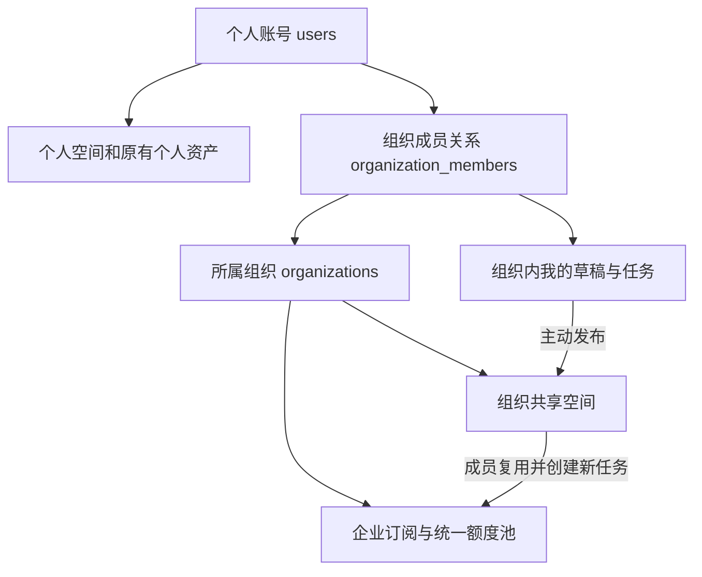
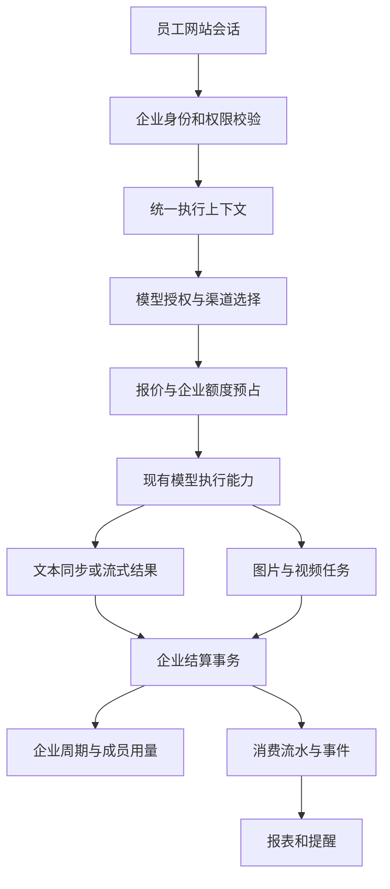
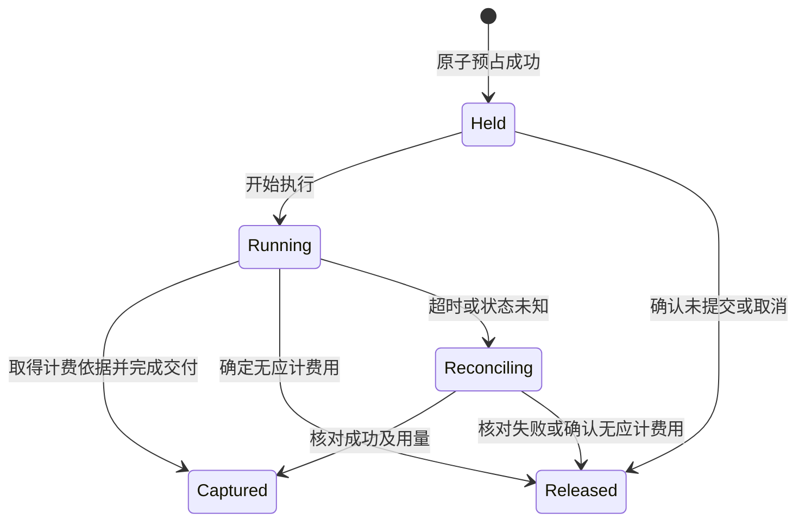

# 组织账号体系、共享空间与统一额度池技术方案

| 项目 | 内容 |
| --- | --- |
| 版本 | v1.1 |
| 日期 | 2026-09-24 |
| 状态 | 技术方案待评审；本次仅编写文档，未开发功能 |
| 适用项目 | sub2api 后端与当前 Vue 前端；新增网站创作工作台 |
| 目标客户 | 百人及以上团队，员工主要通过网站使用服务 |
| 核心决策 | 个人账号归属组织；组织拥有共享空间与统一订阅；文本、图片、视频跨模型、跨分组共享一个总额度池 |

v1.1 增加组织账号归属、账号分配/转组、组织共享内容与素材复用，同步调整权限、数据结构、接口和验收。本文“组织”与原“企业”是同一个租户实体 `organizations`，不是两个层级；企业订阅是组织购买的产品。

## 1. 需求与交付边界

### 1.1 已确认需求

1. 企业开通一份订阅，统一承担成员的使用费用。
2. 员工使用自己的账号登录网站，无需配置 API Key。
3. 所有获授权的文本模型、图片和视频能力，统一消耗企业总额度。
4. 支持企业负责人管理成员、设置成员消费上限、查看团队用量。
5. 企业额度、成员额度和个人账号原有余额相互区分；企业请求不得自动转扣个人余额。
6. 用户已确认目前没有网站创作页面，本版必须同时规划并交付聊天、图片、视频和任务中心。
7. 账号体系增加组织维度，现有个人账号可划入组织；组织拥有供成员使用的共享空间。
8. 一个个人账号只归属一个当前组织，离开或转组后保留历史关系。
9. 草稿仅创建者可见，成员主动发布后供组织成员查看和复用。

示例：企业本周期额度为 10,000，成员甲对话消耗 2，成员乙生成图片消耗 5，成员丙生成视频消耗 30，则企业已消费 37，剩余 9,963。示例中的数值是统一额度单位，不是套餐售价。

### 1.2 本版采用的业务基线

以下为上一轮提出的默认规则，本技术方案按这些规则设计，实施前随方案一并确认。

| 规则 | 本版设计 |
| --- | --- |
| 周期 | 每周期 30 × 24 小时，从实际开通时刻起算，不按自然月 |
| 结转 | 未使用额度不结转到下一周期 |
| 续费 | 同套餐购买后追加完整周期；不立即重置当前额度，不默认自动扣款 |
| 超额 | 停止新的收费请求，不自动扣个人余额或产生企业透支 |
| 套餐 | 同一企业同一时刻只有一个生效的企业套餐；可同时授权多个平台和分组 |
| 成员额度 | 跨所有模型合并的周期上限；不提前划拨公共额度 |
| 角色 | 负责人、企业管理员、普通成员 |
| 账号归属 | 已确认：一个个人账号同时只归属一个组织，保留历史成员关系 |
| API | 第一版面向网站，不提供企业 API Key 的创建和导出入口 |
| 共享空间 | 每个组织默认一个共享空间，成员可查看、下载和复用已发布的内容 |
| 内容发布 | 已确认：“我的草稿”仅自己可见，主动发布后组织内共享 |

企业总额度按周期控制，第一版不另加日/周额度池。RPM、执行并发、排队长度、单请求费用上限是独立风控配置，不产生额外的消费账本。

### 1.3 本版交付

- 平台后台：组织开通与停用、负责人指定、现有账号批量划入组织、账号转组、企业套餐配置、人工授权、账单查询。
- 企业管理：邀请成员、批量邀请、角色调整、成员停用/移除、限额管理、负责人转移。
- 员工使用：新增网站工作台，选择企业空间、查看获授权能力、提交文本/图片/视频请求、查询自己的任务与用量。
- 组织协作：共享图片、视频、提示词和对话快照，支持查看、下载、复用与下架，保留发布人和后续创作归因。
- 计费：统一报价、额度预占、实际结算、失败释放、异常补偿、可追溯流水。
- 支付：企业套餐购买与续费、权益快照、幂等履约、企业订单查询。
- 运营：消费统计、CSV 导出、额度阈值提醒、到期提醒、审计和监控。

不包含部门层级、项目预算、SSO/通讯录同步、实时多人共同编辑、跨组织公开分享、自助退款、额度加购、中途套餐升级、多币种额度池。账户原有登录方式继续复用。

### 1.4 网站创作入口的交付边界

当前源码包含账号、订单、用量、模型网关和生成任务能力，尚无完整网页聊天/图片/视频工作台。用户已确认“还没有，需要一起规划网站创作页面”。

本版直接在当前 Vue 前端内新增企业创作工作台，复用 `AppLayout.vue`、`AppSidebar.vue` 和现有登录体系；由 sub2api 提供同源网站执行 API。首页自定义内容与 iframe 能力不承担企业身份传递，不需要员工跳转第三方网站或配置 API Key。

网站交付包含聊天会话、图片生成与编辑、视频生成及受支持后续操作、批量图片入口、任务历史、上传附件、结果预览与下载。企业身份、报价、预占、执行与账单形成同一个闭环。

第一版优先支持企业空间创作；个人空间继续保留现有账号和 API 管理功能，不自动扩展为新的个人创作计费产品。未来复用工作台到个人空间时另行启用个人计费入口。

### 1.5 账号、组织与空间的关系



- 个人账号是登录身份，加入组织不创建第二套账号，不改变密码、第三方登录绑定或站点角色。
- 组织是成员、订阅、账单和共享内容的归属主体；一个组织不等于一个模型分组，也不等于一个可以共用密码的用户。
- 个人空间继续保存原个人余额、订阅、Key 和历史数据；划入组织不会自动迁移这些资产，也不会向组织公开个人历史内容。
- 组织工作区分为“我的草稿/任务”和“组织共享空间”。在组织内创建的两类内容都按组织额度计费，内容是否共享不改变扣费方。
- 每个组织自动创建一个共享空间。第一版不支持组织内多个项目空间及空间级独立预算，后续可在组织下扩展。
- 共享是查看和复用权限，计费仍归到实际发起新生成的成员；查看、下载或发布已有内容本身不产生模型生成费用。

按已确认的“一个账号一个当前组织”实施以下归属约束。数据保留独立成员关系表以保存成员状态、角色和历史，不通过直接覆写 `users.organization_id` 改变既有数据归属；本版不提供多组织并行成员能力。

## 2. 当前实现与改造依据

以下为本次本地源码检查结论，未连接生产数据库、未验证生产页面或执行请求。

| 当前能力 | 源码位置 | 与企业功能的关系 |
| --- | --- | --- |
| 用户余额、冻结余额、展示余额、并发 | `backend/ent/schema/user.go` | 属于个人资产，企业消费不能写回负责人或员工余额 |
| 个人订阅绑定用户与分组 | `backend/ent/schema/user_subscription.go` | 不能为每位员工复制订阅，否则额度会被放大 |
| 分组包含平台、价格、日周月额度 | `backend/ent/schema/group.go` | 保留路由与定价；企业请求不使用其个人订阅额度作为扣费池 |
| 个人订阅 24 小时/7 天/30 天窗口 | `backend/internal/service/user_subscription.go` | 企业采用独立、统一的 30 天周期，不复用成员各自的窗口 |
| 网关鉴权按用户查订阅或余额 | `backend/internal/server/middleware/api_key_auth.go` | 网站企业入口需要独立计费身份，避免个人余额不足拦截 |
| 用量扣费命令绑定用户和 API Key | `backend/internal/service/usage_billing.go` | 必须区分实际操作者、资金承担方和调用凭证 |
| 现有事务扣费与请求去重 | `backend/internal/repository/usage_billing_repo.go` | 复用事务、去重思想，企业新增独立预占和流水 |
| PP 视频持久化、预占与结算 | `backend/internal/handler/pp_video.go`、`backend/internal/service/pp_video_billing.go`、`backend/internal/repository/pp_video_task_repo.go` | 当前个人订阅分支不会按企业规则预占，需要单独适配 |
| 异步图片记录主要在 Redis | `backend/internal/service/image_task.go`、`backend/internal/repository/image_task_store.go` | Redis TTL 不能成为企业账务和任务恢复的唯一依据 |
| 批量图片独立报价与结算 | `backend/internal/service/batch_image_public.go`、`batch_image_settlement.go` | 必须接入企业池，并处理部分成功及父子任务去重 |
| 支付履约按用户开通订阅 | `backend/internal/service/payment_fulfillment.go` | 企业订单需要受益企业和企业权益履约分支 |
| 个人实余额与展示余额分开处理 | `backend/internal/service/payment_amounts.go` | 企业额度不得直接套用个人充值赠送比例 |
| 用户路由、布局和自定义页面 | `frontend/src/router/index.ts`、`frontend/src/components/layout/AppLayout.vue`、`frontend/src/views/user/CustomPageView.vue` | 复用布局与登录，新增原生企业创作及管理页面 |

工作区已有较多未提交变更。开发时以最新状态重新核对接入点，不覆盖既有模型、图片和视频适配。本方案中的新表名、接口名和服务名为建议设计，不表示已经存在。

## 3. 总体架构

继续使用当前 Go/Gin/Ent/PostgreSQL/Redis/Vue 技术栈，作为现有应用中的企业模块部署，不拆分微服务。



三个职责必须分开：

- **用户身份**：`actor_user_id` 表示哪个员工操作，永远不替换成企业负责人 ID。
- **计费归属**：`billing_subject_type = organization`，指向企业订阅和周期。
- **路由选择**：`group_id`、模型和上游账号决定执行路径，不决定额度归属。

另外，资源访问范围独立于上述计费身份：私有草稿按创建者授权，共享资源按有效组织成员关系及已发布状态授权，不能通过“由企业付费”推断所有内容自动公开。

### 3.1 统一执行上下文

新增服务端内部结构 `ExecutionContext` / `BillingContext`，建议包含：

| 字段 | 含义 |
| --- | --- |
| `entrypoint` | `personal_api` 或 `organization_web` |
| `actor_user_id` | 实际登录员工 |
| `organization_id`、`membership_id` | 已验证的企业和成员关系 |
| `organization_subscription_id`、`quota_period_id` | 本次费用所属订阅和周期 |
| `api_key_id` | 可空；第一版企业网站调用没有客户 API Key |
| `group_id`、`requested_model` | 服务端批准的渠道与请求模型 |
| `operation_id`、`reservation_id` | 本地业务操作及其预占 |
| `pricing_snapshot_id` 或快照内容 | 本次报价版本、倍率和计算依据 |
| `membership_version`、`policy_version` | 权限诊断及缓存失效依据，最终授权仍查服务端状态 |
| `source_shared_references[]` | 可选的共享条目、版本和资产引用列表，用于多参考素材复用溯源，不替代操作者和计费归属 |

前端只提交企业选择、模型、参数和幂等键，不提交可直接生效的费用、权限、成员 ID、订阅 ID 或周期 ID。服务端独立解析、授权、报价并冻结上下文。

### 3.2 API Key 兼容策略

选择显式支持网站执行身份，不创建百人共用 Key，不伪造 `api_key_id = 0`，不把浏览器 JWT 当成网关 API Key。

现有代码多处通过 `APIKey.User`、`APIKey.Group` 获取执行信息，因此需要把被网站使用的服务入口改为显式读取用户、分组和计费上下文。个人 API 路径通过适配器构建相同上下文，保留原行为。复用服务层执行器，不在后端发 HTTP 请求回调自身网关，也不拼造 Gin 鉴权上下文绕过检查。

企业网站记录所经过的 `usage_logs`、PP 视频任务等强制 Key 字段需要支持可空，并增加 `entrypoint` 和企业归属约束；批量图片已有可空 Key，但仍需验证完整调用链。调整所有相关 ORM edge、DTO、JOIN、统计、去重和删除逻辑，避免 NULL Key 记录被内连接遗漏。个人 API 数据继续要求真实 Key。

原 `usage_billing_dedup` 的个人 `(request_id, api_key_id)` 规则保持有效；企业使用独立的业务操作/结算唯一键，不依赖可空字段的唯一性语义。

## 4. 企业、成员与权限

### 4.1 权限矩阵

| 操作 | 负责人 | 企业管理员 | 普通成员 |
| --- | --- | --- | --- |
| 使用获授权模型、查看自己的任务 | 是 | 是 | 是 |
| 查看企业总额及自己的限额 | 是 | 是 | 是 |
| 查看团队消费统计、导出用量 | 是 | 是 | 否 |
| 邀请、停用和移除普通成员 | 是 | 是 | 否 |
| 设置普通成员限额和权限 | 是 | 是 | 否 |
| 设置管理员、调整管理员权限 | 是 | 否 | 否 |
| 购买/续费、查看支付订单 | 是 | 否 | 否 |
| 转移负责人、变更企业关键设置 | 是 | 否 | 否 |
| 查看其他成员未发布的草稿和任务内容 | 否 | 否 | 否 |
| 查看、下载、复用组织已发布共享内容 | 是 | 是 | 是 |
| 发布自己的组织内容、管理自己发布的条目 | 是 | 是 | 是 |
| 下架其他成员发布的共享条目 | 是 | 是 | 否 |

平台超级管理员沿用站点现有管理权限，企业角色不写入 `users.role`。任何运营人员查看内容的能力如需开放，应另行设计授权和审计，不由团队消费报表隐式提供。

### 4.2 成员生命周期

成员关系状态为 `active / suspended / removed`。同一企业与用户保持稳定关系 ID，移除后再加入复用该关系，以免通过重复加入重置当期用量。

按已确认的单组织规则，同一用户最多有一个 `active` 或 `suspended` 的组织关系，停用不等于自动解除所属组织；`removed` 关系仅作为历史。账号资料与后台用户列表展示当前所属组织、组织角色和成员状态，可按组织筛选，不能以角色覆盖个人账号身份。

账号划入支持两种入口：平台管理员选择已有账号批量分配，或组织邀请用户接受加入。已有当前组织的账号不能被另一个组织的邀请/批量操作静默覆盖，需走显式转组流程；组织管理员只能邀请，不能直接拉取全站用户并强制划入。

平台分配操作核验账号状态、目标组织状态和席位，记录原因与操作审计，并通知用户。批量结果逐账号返回成功或失败。只建立成员关系，不重置密码、不移动个人数据、不把个人余额转成组织额度。

转组由平台管理员执行：检查原组织负责人是否已完成转移、目标组织与席位，在同一事务内移除旧关系、激活或恢复目标关系，失效旧组织权限并记录审计。转组按用户身份锁串行化、涉及组织按 ID 顺序加锁，再遵循各组织成员和额度锁顺序。邀请、直接划入、恢复和转组均受数据库有效关系唯一约束保护。

转组后新任务使用新组织额度；原组织历史账单、在途任务及已发布共享内容仍归原组织。离职、转组或再次加入不迁移旧周期用量，也不恢复对旧组织内容的访问。原组织未发布草稿仍保持原组织范围和原创建者可见规则，停用期间无人因管理员身份自动获得其内容。

活跃成员占用席位，负责人也占用一个席位；待接受邀请、停用和移除成员不占用席位。接受邀请及恢复成员时，在企业锁下原子校验活跃席位数，避免批量并发加入超员。

邀请绑定被邀请邮箱，使用随机高熵凭证并仅持久化摘要，有效期建议 7 天；接受时要求账号邮箱已验证且匹配。批量接口逐项返回成功/失败结果，默认每批最多 200 人。邀请接受自身幂等；全站关闭公开注册时，有效企业邀请只授予该邀请范围内的受控注册能力。

负责人不可直接退出、移除或被管理员降级，需先完成原子转移；候选人必须是当前有效成员。负责人转移与高权限变更复用敏感操作二次验证机制并记录审计。

### 4.3 停用与数据隔离

- 停用事务提交后，新的收费预占必须拒绝；在事务提交前已成功预占的请求视为已受理任务。
- 新请求不能只依赖 JWT 中缓存的成员角色。预占事务校验企业和成员状态；角色变更使权限缓存失效。
- 成员被停用/移除后不能继续查询企业任务内容；后台结算不依赖成员仍为 active。
- 订阅到期或额度耗尽但成员仍有效时，允许查询自己的已受理任务及现有共享内容；新的生成继续受订阅与额度限制，文件读取仍受保留期约束。
- 私有内容查询限定企业和创建者；共享内容查询限定企业、有效成员及条目发布状态。按任务 ID、共享条目 ID、导出 ID 或下载 ID 单独查询必须重复执行对应授权。
- 对象存储使用私有对象和短期签名下载地址，建议 5 分钟。企业停用后不再签发地址；已经签发的地址可能在剩余有效期内可用，界面和验收不得承诺立即撤销所有已下载/已签发内容。
- 网页按标签页保留空间选择；提交时固定企业，上一个空间的异步响应不能覆盖新空间界面。

### 4.4 组织共享空间规则

共享空间支持图片、视频、提示词和对话快照。已确认成员先在“我的草稿”创作，再主动发布到组织；发布预览明确展示即将共享的文字、选中结果和附件。用户自己的个人空间内容不因账号划入组织自动发布。

1. **共享快照**：对话共享只包含选中的消息分支与确认的附件，图片/视频共享只包含选中成果及明确公开的参数。发布固定内容版本，不暴露原始任务、私有消息、隐藏工具结果或上游地址。
2. **成员复用**：组织有效成员可查看、下载，把共享图片/视频作为参考素材，复制提示词，或把共享对话复制为自己的组织内新会话。第一版不直接多人编辑同一对话。
3. **费用归因**：复制或浏览不触发模型费用；点击继续对话、再次生成、放大或视频延长时创建新操作，扣当前组织总池并累计到新操作者，原发布人不承担这笔成员用量。
4. **结果可见性**：复用后新生成的内容默认回到操作者的草稿；不会因为来源是共享内容而自动发布新的结果。
5. **权限检查**：读取源共享条目、下载、复制及预占时核验成员身份、条目状态及同组织关系；向模型提交引用时核验受理时固定的合法版本和文件引用，不重新扩大范围。外部组织条目即使知道 ID 也不可引用。
6. **撤销与在途引用**：发布人可下架自己条目，负责人/管理员可下架组织条目；下架后停止新读取、下载签发和复用。已受理任务使用提交时合法固定的引用继续执行，保留引用到任务结束，不因下架释放已受理费用。
7. **组织留存**：发布快照及关联资产作为组织共享记录保留，不因创建者离职、转组或删除源草稿而消失；按组织保留期到期或显式下架处理。普通成员不能删除他人共享成果。
8. **撤销边界**：短期已签发 URL、已下载文件及已复制到成员草稿的内容无法因下架远程收回；界面不得暗示可以追溯删除所有副本。

已发布内容更新采用新版本并记录审计；已受理引用固定版本，不随更新变化。重新发布/重试使用幂等键，避免重复复制资产。发布不把源记录变成全员可访问的通用入口，共享页面只读取经过授权的内容快照。

共享引用的发布状态检查与任务受理在同一预占事务内完成，不能只在报价或页面预览时检查。预占对源共享条目按 ID 顺序加共享锁，下架/改版对相同条目加排他锁，形成明确先后关系；固定引用在操作持久化后才可供 Worker 使用。组织/成员/额度锁在前，共享条目锁在后，操作/预占锁最后，管理接口也遵循一致顺序。

## 5. 数据模型

金额/额度统一采用 PostgreSQL `NUMERIC(20,10)`，服务计算采用项目已有的 decimal 工具。API 对精确额度使用十进制字符串，显示时再格式化。时间存 UTC，页面按用户时区展示。

以下为逻辑模型，具体 Ent 字段与迁移按开发时现有约束落地。

### 5.1 企业与套餐

| 表 | 关键字段与约束 |
| --- | --- |
| `organizations` | `id, name, owner_user_id, status, policy_version, created_at`；状态 `active/suspended/closed`；有账务关系时不硬删除 |
| `organization_members` | `id, organization_id, user_id, role, status, period_limit, concurrency_limit, policy_version`；`UNIQUE(organization_id, user_id)` |
| `organization_invitations` | 企业、邮箱、角色、凭证摘要、过期时间、状态、邀请人、接受用户；限制同企业同邮箱的有效重复邀请 |
| `organization_plans` | 名称、售价、支付币种、每周期额度、30 天周期、席位、并发、RPM、版本、在售状态 |
| `organization_plan_entitlements` | 套餐版本、`group_id`、允许模型/操作、请求费用上限、企业价格规则；同分组授权唯一 |
| `organization_subscriptions` | 企业、套餐与权益快照、`starts_at, paid_until, status`；企业下最多一个 active 订阅；旧订阅保留供在途任务结算 |
| `organization_subscription_grants` | 来源订单或人工授权操作、订阅、追加周期数、`coverage_start/end`、权益快照；来源唯一，用于幂等履约及未来周期追溯 |

第一版模型授权采用明确列表或“该分组全部模型”的显式策略。平台关闭模型、分组或相关能力时可立即阻止新请求；企业套餐快照不保证已停运的上游永远可用。

账号当前归属以 `organization_members` 为唯一事实来源。按已确认单组织规则增加部分唯一索引 `UNIQUE(user_id) WHERE status IN ('active', 'suspended')`，保证并发分配时不会产生两个当前组织。用户 DTO 可返回由关系查询出的 `current_organization`，不增加另一份需要同步维护的账户归属列；所有审计和历史账务仍保留原始组织 ID。

### 5.2 额度与流水

| 表 | 关键字段与约束 |
| --- | --- |
| `organization_quota_periods` | 企业、订阅、序号、开始/结束、额度总数、已消费、预占、生命周期；`UNIQUE(subscription_id, period_index)` |
| `organization_member_usage` | 企业、周期、稳定成员 ID、已消费、预占；`UNIQUE(period_id, membership_id)` |
| `organization_billing_operations` | 本地操作 ID、企业、成员、幂等键、请求摘要、操作类型、周期、任务 ID、执行状态；`UNIQUE(organization_id, actor_user_id, operation_type, idempotency_key)` |
| `organization_quota_reservations` | 操作 ID、周期、成员、预占金额、实扣金额、状态、报价快照、上游请求/任务引用、恢复检查时间；操作唯一 |
| `organization_quota_ledger` | 不可变事件 ID、企业/周期/成员、操作、事件类型、`delta_used, delta_reserved`、价格/用量摘要、审计操作者；事件幂等唯一 |

操作表保存可恢复的任务归属和最小执行元数据；敏感提示词、参考文件与输出通过受控业务存储引用，不混入计费流水。企业异步图片必须有数据库持久化任务状态或关联记录，不能只保存在 24 小时 Redis 任务中。

成员消费上限：`NULL` 表示不额外限制，`0` 表示不能消费。第一版以成员当前策略为准，不因新周期重新覆盖管理员设置；新增成员可继承企业默认值。调整上限时新值不得低于当期“已消费 + 已预占”，需要立即禁用时使用停用成员。

关键不变量：

```text
企业可用额度 = period.quota_total - period.used - period.reserved
成员可用额度 = period_limit - member_usage.used - member_usage.reserved
实际可接受的预占 <= 企业可用额度，且 <= 有限额时的成员可用额度
used >= 0，reserved >= 0，used + reserved <= quota_total
企业当期 used/reserved = 当期所有成员 used/reserved 之和
企业当期 used/reserved = 该周期账务事件增量之和
```

企业订阅开通、周期生效、调账等事件均留可追溯记录。更正费用通过补偿事件，不能修改或删除历史流水；第一版普通管理员不提供任意额度调账入口。

### 5.3 扩展现有记录

- `payment_orders`：增加受益企业、企业套餐版本、企业订阅关联、购买周期数和权益快照；保留购买人 `user_id`。
- `usage_logs`：增加 `billing_subject_type, organization_id, membership_id, organization_subscription_id, quota_period_id, billing_operation_id, entrypoint`；企业网站调用的 `api_key_id` 可空，原个人订阅字段不复用为企业订阅 ID。
- PP 视频、批量图片、其他持久化任务：增加企业、成员、周期、操作、预占引用和价格快照；不在轮询阶段重新解析当前付款主体。
- 审计记录：补充企业、实际操作者、目标成员和变更前后值，复用现有审计设施。
- 报表/缓存：增加企业维度；普通用户“个人空间”报表明确排除企业资金消费，避免把企业消费显示为个人余额支出。

使用组合外键或等效约束保证成员、周期、操作属于同一企业，不能只依赖分别存在的单列外键。企业字段与入口字段设 CHECK 约束：企业网站记录必须具有企业和操作归属；历史个人记录企业字段为空。

主要索引：成员 `(user_id, status)`、企业流水 `(organization_id, created_at, id)`、成员流水 `(organization_id, actor_user_id, created_at)`、待恢复预占 `(status, next_check_at)`、到期订阅 `(status, paid_until)`、任务 `(organization_id, actor_user_id, created_at)`。报表使用分页和聚合，不能在每次请求前扫描流水求余额。

### 5.4 网站会话与生成资产

网站工作台还需要以下业务存储，不能仅依赖浏览器 localStorage 或网关短期结果缓存：

| 表 | 关键字段与用途 |
| --- | --- |
| `workspace_conversations` | 企业、创建用户、标题、默认模型、创建/更新时间、软删除时间；对话永久绑定创建时的企业 |
| `workspace_messages` | 会话、父消息、角色、内容、状态、模型、关联计费操作、客户端消息 ID；支持重新生成的消息分支与幂等发送 |
| `workspace_assets` | 企业、创建用户、来源操作、私有对象 key、MIME、大小、校验摘要、图片尺寸/视频时长、用途、可用状态、过期时间 |
| `workspace_message_assets` | 消息和资产的关联及引用角色，例如 `reference_image`、`reference_video`，不能凭文件名推断用途 |

生成任务的执行和计费状态以已有供应商任务记录及 `organization_billing_operations` 为准，工作台统一映射展示，不再复制另一套独立扣费状态机。资产元数据进入 PostgreSQL，文件进入 S3 兼容私有对象存储；Redis 只用于短期状态加速。

原始会话、消息、资产和计费操作保留企业与创建用户归属，原始详情入口仍仅允许创建者访问。组织共享通过独立发布快照和共享资产引用授予访问权，不放开对原始任务的所有权检查。成员删除源会话/资产只处理个人可见的源内容，不删除共享快照、有效引用或消费记录。会话不能直接移动到另一企业；第一版不提供跨组织复制入口。

已付费使用的参考资产在执行期间保留引用，清理任务不能删除正在使用的输入文件。未关联任务的临时上传建议 24 小时后清理；生成文件保留期作为部署参数，建议默认 30 天，并在工作台明确展示到期时间。内容留存与账务留存分别配置，不能随生成文件清理而删除计费事实。

### 5.5 组织空间与共享内容数据

| 表 | 关键字段与约束 |
| --- | --- |
| `organization_spaces` | `id, organization_id, name, kind, status, created_at`；第一版 `kind = shared`，`UNIQUE(organization_id, kind)`，创建组织时幂等创建 |
| `organization_shared_items` | 空间、组织、内容类型、标题、发布人、当前版本、`published/archived` 状态、创建/更新时间；内容类型为 image/video/prompt/conversation |
| `organization_shared_item_versions` | 共享条目、版本号、不可变内容快照、源操作/会话内部引用、发布说明、发布人、发布时间；`UNIQUE(shared_item_id, version)` |
| `organization_shared_item_assets` | 共享版本、组织、资产引用、公开用途和展示顺序；所有关联必须同组织，只有确认公开的附件可写入 |

资产可以共享底层私有文件，但必须有独立的共享引用及保留期限；垃圾回收检查源草稿、共享版本和在途任务全部引用。源草稿删除不能使已发布条目失效，发布也不能无限重置文件到期时间。共享资产沿用部署配置的组织保留期，页面同时展示条目与附件可用状态。

内容快照不直接包含永久下载 URL，读取时根据当前成员权限临时签发。共享详情 DTO 不返回原始任务查询地址或内部源 ID；后续模型动作需要源信息时由服务端解引用，并再次校验条目和模型权限。

新增索引 `(organization_id, space_id, status, created_at, id)`，以及发布人和内容类型过滤索引；组织共享列表必须先按组织和发布状态过滤再分页、搜索和统计。普通成员不读取下架版本；引用旧版本的后台任务只可按已受理操作授权读取。

## 6. 周期、续费与支付

### 6.1 周期生成

设开通时刻为 `S`，周期长度 `D = 30 × 24h`：第 `n` 个周期为 `[S + nD, S + (n+1)D)`。预占时使用数据库时间确定周期；所有成员共享同一个边界。

首笔成功支付或人工授权立即开通；期间续费把 `paid_until` 追加 N 个完整周期并记录 grant，不修改当前周期计数。周期可以预生成或请求时惰性创建，但必须在事务中依赖唯一约束防止重复发放。定时任务负责通知和状态维护，不是额度重置正确性的前提。

到期后重新购买创建新的订阅区间，从新的生效时刻起算；旧订阅及其周期不复用、不清空。退款处理中、企业冻结或旧订单状态不确定时，由履约状态机决定能否开通，不能仅通过前端支付结果页判断。

### 6.2 跨周期在途任务

旧周期到期后停止新预占，已有预占仍保留在旧周期；下一周期额度独立发放。旧任务成功后在旧周期把预占转为消费，失败释放也只回到旧周期，不转赠新周期。

周期先进入“已结束、待结算”，预占归零后归档。不能在月底把 `reserved` 清零，不能把旧任务费用扣到新周期。

### 6.3 支付履约

新增明确的企业订阅订单类型，例如 `organization_subscription`。订单价格、受益企业和购买周期必须由服务端从套餐解析，订单快照冻结权益及售价。购买币种是支付币种，额度计量单位是另外一个字段，两者不可混算。

沿用现有支付渠道、签名验证、金额核验、订单状态机和通知入口，增加企业履约分支。支付成功后在本地事务内锁定订单与企业订阅、写入唯一 grant、追加有效期或开通订阅、记录履约审计；重复回调和人工重试不得重复开通或延期。

新建订单时检查负责人身份；已成功支付的有效订单按订单快照履约，不因负责人正常转移而改到另一企业。企业已关闭、被冻结或出现权益冲突时进入可恢复的人工处理状态并保留已支付事实，不静默转入个人余额。

第一版不开放企业自助退款。现有通用退款接口必须显式识别企业订单并拒绝走个人余额退款逻辑；异常退款需平台处理，核对未生效 grant、已使用额度和在途预占后记录补偿事件。支付成功但履约失败的订单可重试并告警。

## 7. 统一价格与额度单位

企业池内部计量单位建议沿用现有模型报价的 USD 计费单位，接口明确返回 `quota_unit = USD`，页面可显示“额度”，并提供统一换算说明。套餐售价可以使用人民币或其他现有支付币种，但不意味着“售价 1 元 = 1 额度”。第一版不引入浮动兑换率或个人充值赠送倍率。

企业实际扣费沿用对应模型的客户侧计费公式，包括 token、图片张数、分辨率、视频时长、输出数量、工具调用及适用倍率。企业以套餐授权的价格规则为准，不继承成员私人折扣；上游账号成本用于平台成本统计，不直接替代客户价格。

每次请求冻结价格快照：模型、操作、报价版本、单价、费用组成、渠道/企业倍率、可能的峰时倍率、批量折扣和参数边界。实际用量可在完成时确定，价格规则不得在结算时因管理员修改而变化。回退到其他模型/渠道不能突破授权范围或预占上限；需要变化时先完成增额预占，失败则停止回退。

企业预占及最终结算公式使用 decimal；若复用路径返回 `float64`，必须在报价边界按明确精度转换并验证误差，不允许直接累加浮点余额。单请求最终费用向上舍入到 10 位小数，预占同样向上舍入；界面的小数位缩略不改变底层余额。

## 8. 预占、执行与结算

### 8.1 请求进入与原子预占

1. 网站会话鉴权，校验企业成员关系、角色、模型权限、请求体和资源归属。
2. 查找幂等操作；同一幂等键且请求摘要一致时返回已有操作状态，摘要不同返回冲突，不再次执行。
3. 解析可执行渠道与价格快照，计算可验证的最大费用；获取企业和成员执行名额。
4. 开启数据库事务，锁定并复核企业、成员、订阅、周期和成员计数，确认席位状态、有效期与额度。
5. 原子创建业务操作及预占，增加企业和成员 `reserved`，追加预占事件；异步任务/待执行事件在同一事务持久化。
6. 提交后才调用上游；预占失败不产生收费请求，释放已经取得的并发名额。

所有事务固定锁顺序：企业、成员关系、订阅、额度周期、成员用量、共享源条目（如有，按 ID 排序）、操作/预占。账号归属变更先取得用户身份锁，再按组织 ID 排序进入同一锁顺序。单纯校验状态使用兼容的共享锁，状态变更与额度修改使用适当排他锁。执行期间不持有数据库事务。成员停用等管理事务遵循相同顺序，使停用与预占有明确先后关系。

幂等唯一约束是最后防线；并发插入失败后回滚并读取已有操作，不吞掉非唯一冲突错误。锁等待和死锁采取有界重试，不在超时后无条件重新提交上游任务。

### 8.2 不同能力的费用上限

| 能力 | 预占方法 | 结算方法 |
| --- | --- | --- |
| 文本/多模态对话 | 输入计费上界 + 强制最大输出 + 工具调用上限；对缓存按较高价格保守预占 | 使用最终实际 token、缓存和工具用量，释放差额 |
| 同步/异步图片 | 输出数量、分辨率和计费模式的上限；含按 token 计费模型的相关上界 | 成功交付的计费结果按实际费用结算 |
| 视频 | 数量、最长生成/输入时长、清晰度、音频等全部计费维度上限 | 获得可用最终结果后结算，失败释放 |
| 批量图片 | 所有条目最大费用合计预占；不能沿用低于最终费用的个人折扣预占倍率 | 子项分别按实际成功结果结算，父任务只汇总，不再次扣费 |
| 变体、放大、重绘、续写等后续操作 | 每次作为独立收费操作报价，校验原始任务属于当前企业和成员 | 独立预占与结算，不能因为依赖旧任务而绕过计费 |

文本工具递归必须有最大轮次/调用次数；没有明确 `max_output_tokens` 的请求由企业策略补齐上限。对于无法验证硬费用上限的供应商能力，先完成保守上界适配，未完成前不得标记为已支持企业硬限额。不能用一个经验倍率承诺绝对不超额。

如果上游异常报告实际费用超过预占，正常路径不直接透支企业：记录全额上游成本及异常差额，对企业可扣金额执行保护，冻结该模型新企业调用并告警核查。不能事后把差额自动扣个人余额。该保护用于异常，上线前仍须验证报价上界。

### 8.3 结算事务

对预占 `H`、确认实扣 `C`，正常情况 `0 <= C <= H`：

```text
企业 reserved -= H，used += C
成员 reserved -= H，used += C
预占状态 -> captured，actual_amount = C
追加唯一结算事件，记录 delta_reserved = -H，delta_used = C
持久化用量事件和任务结算状态
```

确定失败时 `C = 0`，以唯一 release 事件释放 `H`。部分成功按交付部分结算，剩余释放。批量采用“父操作只汇总、子操作拥有预占”的结构：一次事务为所有子项预占，子项金额之和等于对外展示的批次总预占，父操作不再额外增加计数。各子项独立捕获/释放，父任务结束只触发尚未结算子项的核对与释放。

企业和成员计数、预占状态、企业流水必须在一个数据库事务里变更。上游账号额度若属于同一数据库的同步计费副作用，则加入同一事务；其他异步副作用以唯一事件投递，消费者幂等。可复用现有机制，缺少可靠事件投递时增加事务 outbox，不依赖进程内队列保证账务写入。

企业路径只能执行一次企业结算，不能再调用个人扣费 fallback。同步、流式、图片、视频、批量任务、回退渠道和 legacy 路径都必须检查这一点。详细用量报表允许短暂延迟，但最终金额可由不可变企业流水重建。

### 8.4 状态机与恢复



- HTTP 超时、页面关闭、Redis 键过期、停止轮询都不等于上游失败，不能直接释放预占。
- Worker 提交前写入执行意图和本地操作 ID；上游支持幂等键时传递稳定键。遇到“提交可能成功但尚未写入 task_id”的故障，不盲目重发；通过供应商查询或人工核对进入恢复流程。
- 后台扫描长期 held/running/reconciling 记录；使用租约或任务锁避免重复恢复，不只依赖请求进程存活。
- 流式请求必须收集最终用量；用户断开时尝试取消并继续核对已经发生的消费，不能把已交付的 token 一律当作失败退款。
- 上游成功但图片保存失败、视频链接不可读时，不提前认定交付成功；先尝试恢复资产。最终无法交付的生成任务释放用户额度，上游成本单独记录。
- 迟到回调仅能按状态机和唯一事件处理。已释放后收到冲突成功结果进入异常核对，不重新向企业追扣。
- 未知状态超过运营阈值进入人工核对队列；金额调整须补偿事件、原因和操作者，不通过后台 SQL 清零预占。

## 9. 并发、限流与缓存

成员数量不等于同时生成数量。分别配置企业最大执行并发、成员执行并发、RPM、排队上限、异步未完成任务上限及单任务最大费用。

Redis 负责企业和成员的限流及执行租约，额度和成员有效状态由数据库最终校验。长任务续租，释放幂等；对 PP 视频等上游仍执行的任务，进程失联后先核对状态，不能仅因租约过期就无限放开新的生成任务。受理任务计数需能从持久化操作恢复。

同一请求检查的是所有适用限制的交集，不把成员并发相加当成企业总并发。批量任务子项也要计入实际执行并发。数据库或无法可靠执行限制的关键缓存故障时，企业收费写入返回可重试错误，不能放行绕过。

企业权限缓存按企业和成员区分；额度概览缓存建议 3 秒，关键预占不信任该缓存。报表可延迟更新，但不能将报表汇总结果作为资金判断依据。缓存键、幂等键、任务查询和导出都必须包含企业范围。

单企业额度行会形成短事务竞争，第一版优先保证一致性，不做额度分片。验收需测量真实并发下的锁等待、事务时延和失败率；没有压测前不承诺 QPS。

## 10. 接口设计

以下接口均为拟新增，统一位于 `/api/v1` 下，复用现有 JSON 响应封装、分页和错误格式。成员接口使用站点登录会话，服务端校验企业范围。JWT 的传递方式复用当前登录实现；如新增 Cookie 会话须同步设计 CSRF 防护。

### 10.1 企业管理与查询

| 方法和路径 | 权限 / 行为 |
| --- | --- |
| `GET /organizations` | 当前用户加入的企业，含角色和状态 |
| `GET /organizations/:id` | 当前有效成员可读企业基础信息 |
| `GET /organizations/:id/overview` | 企业额度概览和自己的当期用量；团队明细按角色返回 |
| `GET /organizations/:id/models` | 服务端计算的可用模型、操作、参数上限和价格展示信息 |
| `GET /organizations/:id/members` | 负责人、管理员分页查询成员 |
| `POST /organizations/:id/invitations/batch` | 批量邀请；管理员只可邀请普通成员 |
| `DELETE /organizations/:id/invitations/:invitation_id` | 撤销未接受邀请 |
| `POST /organization-invitations/accept` | 登录后提交邀请凭证，验证邮箱、席位、幂等接受 |
| `PATCH /organizations/:id/members/:member_id` | 按权限变更角色、限额、模型限制和状态 |
| `DELETE /organizations/:id/members/:member_id` | 逻辑移除，保留关系和历史消费 |
| `POST /organizations/:id/transfer-owner` | 负责人二次验证后转移 |
| `GET /organizations/:id/usage` | 普通成员仅自己的记录；管理员可筛选成员、模型、时间 |
| `POST /organizations/:id/usage-exports` | 管理员发起有范围限制的导出，执行及下载时重新授权 |
| `GET /organizations/:id/subscription` | 订阅摘要；订单和敏感支付信息仅负责人 |
| `GET /organizations/:id/orders` | 负责人查看企业购买记录 |

单组织模式下 `GET /organizations` 至多返回一个当前关系，历史组织不作为可进入空间。扩展个人资料接口返回当前所属组织摘要；平台用户查询支持 `organization_id` 与“未分配组织”筛选。

### 10.2 网站执行入口

| 方法和路径 | 行为 |
| --- | --- |
| `POST /organizations/:id/executions/quote` | 可选预览报价，不占额度；提交时重新校验 |
| `POST /organizations/:id/executions/text` | 文本/多模态对话，支持 SSE 流式，强制输出和工具上限 |
| `POST /organizations/:id/executions/images` | 提交图片生成/编辑，统一返回本地操作 ID |
| `POST /organizations/:id/executions/videos` | 提交视频生成及受支持后续操作 |
| `POST /organizations/:id/executions/batch-images` | 批量图片提交，固定父子操作与预占关系 |
| `GET /organizations/:id/executions/:operation_id` | 已授权任务查询，余额耗尽不阻止查询 |
| `POST /organizations/:id/executions/:operation_id/cancel` | 尽力取消；收到确认前不声明已经退款 |
| `GET /organizations/:id/executions/:operation_id/assets/:asset_id` | 检查资源归属后生成短期下载地址 |

所有收费提交必须携带 `Idempotency-Key`。重复键请求体相同返回已有状态，不重新向上游提交；文本流重连使用操作状态和已保存结果，第一版不要求重放完整 token 流。网页切换空间、刷新或网络重试都不能改变已创建操作的付款主体。

参考响应数据，外层仍使用项目现有封装：

```json
{
  "operation_id": "op_example",
  "organization_id": 123,
  "status": "queued",
  "billing": {
    "quota_period_id": 456,
    "quota_unit": "USD",
    "reserved": "1.2500000000",
    "actual": null
  }
}
```

网页上传图片、引用历史任务或传递资源 ID 时同样验证企业和成员归属；不能只验证最终生成接口而放任附件跨企业读取。服务器抓取远程资源沿用并核对现有 URL/SSRF 防护。

### 10.3 支付与平台管理

- 扩展 `POST /payment/orders`：增加企业订阅类型、`organization_id`、企业套餐版本和购买周期数；服务端校验负责人及价格。
- 企业订单查询与普通“我的订单”明确范围，公共支付恢复接口只返回完成支付所需信息，不泄露企业成员及消费详情。
- 新增平台 `/admin/organizations`、`/admin/organization-plans` 管理接口。
- 新增平台企业授权、停用、恢复接口；人工开通必须携带幂等操作 ID、期限、权益快照和原因。
- 新增 `POST /admin/organizations/:id/members/assign-batch`，将已有个人账号划入组织；逐项校验当前归属和席位，不静默转组。
- 新增 `POST /admin/users/:user_id/organization-transfer`，显式传入源组织、目标组织、原因和幂等键；服务端执行原子转组，禁止覆盖式改用户字段。
- 告警、平台调账、退款处理沿用平台管理权限及审计，不开放给普通企业管理员。

建议错误码：`ORG_FORBIDDEN`、`ORG_SUSPENDED`、`ORG_MEMBER_INACTIVE`、`ORG_SEAT_LIMIT_EXCEEDED`、`ORG_SUBSCRIPTION_EXPIRED`、`ORG_QUOTA_EXHAUSTED`、`MEMBER_QUOTA_EXHAUSTED`、`ORG_CONCURRENCY_LIMIT`、`ORG_MODEL_NOT_ALLOWED`、`IDEMPOTENCY_CONFLICT`、`BILLING_TEMPORARILY_UNAVAILABLE`。错误区分权限、额度、限流和系统故障；越权查询对象统一返回 404。流已开始后通过 SSE 错误事件表达失败，不能尝试更改已发送的 HTTP 状态。

### 10.4 网站会话、任务列表和上传

| 方法和路径 | 行为 |
| --- | --- |
| `GET /organizations/:id/conversations` | 当前用户的会话列表，搜索与游标分页 |
| `POST /organizations/:id/conversations` | 创建绑定当前企业的会话 |
| `GET /organizations/:id/conversations/:conversation_id` | 查询自己会话的元数据及分页消息 |
| `PATCH /organizations/:id/conversations/:conversation_id` | 重命名和默认模型设置 |
| `DELETE /organizations/:id/conversations/:conversation_id` | 软删除会话，不删除账单 |
| `GET /organizations/:id/executions` | 当前用户的任务列表，可按文本/图片/视频、状态和日期过滤 |
| `POST /organizations/:id/uploads` | 受限大小的 multipart 上传，校验文件内容后返回资产 ID |
| `GET /organizations/:id/assets/:asset_id` | 查询本人资产状态及到期时间 |
| `GET /organizations/:id/assets/:asset_id/content` | 鉴权后预览/下载上传或生成资产，签发短期地址 |
| `DELETE /organizations/:id/assets/:asset_id` | 逻辑删除；执行中引用不立即物理删除 |

文本提交使用 10.2 的唯一执行入口，额外提交 `conversation_id`、`parent_message_id`、`client_message_id` 和用户输入。后端核验会话归属并重建所选分支上下文，不接受浏览器伪造已存在的其他用户消息。模型返回的工具操作同样经过服务端能力白名单和调用次数限制。

上传流程限制扩展名、实际 MIME、文件大小、像素/时长及用户/企业存储量；对象 key 由服务端生成，不能接受任意存储路径。第一版可采用受控后端上传，后续大文件直传也必须经过上传授权、完成校验和资产状态确认。

### 10.5 组织共享空间接口

| 方法和路径 | 行为 |
| --- | --- |
| `GET /organizations/:id/shared-space` | 获取组织默认共享空间和成员可用操作 |
| `GET /organizations/:id/shared-items` | 已发布内容列表，支持类型、发布人、关键词和日期过滤 |
| `POST /organizations/:id/shared-items` | 从本人组织内容发布共享快照，服务端核验全部源消息和附件；需幂等键 |
| `GET /organizations/:id/shared-items/:item_id` | 读取当前已发布快照，不返回源私有任务详情 |
| `POST /organizations/:id/shared-items/:item_id/versions` | 发布人更新内容版本；管理员只可管理状态，不冒充发布人改写内容 |
| `POST /organizations/:id/shared-items/:item_id/archive` | 发布人或组织管理者下架并审计，停止新共享访问 |
| `GET /organizations/:id/shared-items/:item_id/assets/:asset_id/content` | 有效成员读取当前共享版本中的资产，生成短期下载地址 |
| `POST /organizations/:id/shared-items/:item_id/copy` | 复制提示词/对话快照到操作者自己的组织草稿，不产生模型调用 |

从共享素材发起生成仍使用 10.2 的执行入口，提交本地共享条目、版本和资产选择。后端在预占阶段验证访问并固定合法引用；原始 `/assets`、`/conversations`、`/executions` 详情接口仍遵循本人所有权规则。共享查看权不能代替模型使用权限、成员限额或执行取消权限。

新增错误码 `USER_ALREADY_ASSIGNED_TO_ORGANIZATION`、`ORG_TRANSFER_CONFLICT`、`SHARED_ITEM_NOT_AVAILABLE`。越权共享条目查询使用 404，分配/转组冲突仅向有管理权限的调用方提供必要原因。

## 11. 前端页面与交互

| 页面 | 内容与约束 |
| --- | --- |
| 空间选择 | 个人空间和当前所属组织；组织内明确区分“我的草稿/任务”和“组织共享空间”；所有收费入口展示付款组织 |
| 账号组织维度 | 平台用户列表展示所属组织、成员角色和状态，支持未分配筛选、批量划入和显式转组 |
| 企业概览 | 总额度、已消费、处理中预占、剩余可用、周期结束、成员数和额度提醒 |
| 成员管理 | 批量邀请、搜索分页、角色、状态、当期用量、限额、停用；邀请失败逐项显示 |
| 企业创作入口 | 原生聊天、图片、视频和批量图片页面；仅显示获授权能力、可用模型、参数范围、报价或预占提示；不要求 API Key |
| 我的任务 | 文本结果、图片、视频、处理中/核对中/成功/失败状态，结果和费用分别可追溯 |
| 企业用量 | 成员/模型/能力/日期筛选，已结算消费与预占分开，支持导出 |
| 订阅与订单 | 负责人购买/续费；显示周期和“不结转、提前续费不重置当前额度”规则 |
| 企业设置 | 名称、默认成员限额、通知阈值、负责人转移；套餐上限不可由企业自行提高 |
| 组织共享空间 | 按图片、视频、提示词、对话筛选，搜索、预览、下载、复制/复用、发布和下架；显示发布人与版本 |

显示计算：剩余可用 = 总额 - 已消费 - 处理中预占。不能仅显示“总额 - 已消费”让用户误以为在途额度仍可用。成员不设限额时显示“共享企业额度”，不能误显示无限企业资金。

额度不足保留输入内容并说明受限的是企业池还是成员限额；确认失败后更新额度。未知结果显示“处理中/核对中”，不能先显示退款成功。停用成员收到权限错误后清理该空间敏感界面缓存。

### 11.1 路由与组件规划

在当前 Vue 项目中新增以下原生路由，复用现有布局、i18n、API 封装和视觉组件：

| 路由 | 页面 |
| --- | --- |
| `/workspace/:organizationId/chat/:conversationId?` | 聊天工作台 |
| `/workspace/:organizationId/images` | 图片创作，包含生成、编辑及批量模式 |
| `/workspace/:organizationId/videos` | 视频创作 |
| `/workspace/:organizationId/tasks/:operationId?` | 我的任务列表及详情 |
| `/workspace/:organizationId/shared/:itemId?` | 组织共享内容列表及详情 |
| `/organizations/:organizationId/overview` | 企业概览 |
| `/organizations/:organizationId/members` | 成员管理 |
| `/organizations/:organizationId/usage` | 团队消费统计 |
| `/organizations/:organizationId/subscription` | 套餐、续费和订单 |
| `/organizations/:organizationId/settings` | 企业设置 |

建议新增 `views/workspace/`、`views/organization/`、`components/workspace/`、`api/organizations.ts`、`api/workspace.ts` 和企业空间 store。路由中的企业 ID 是选择信息，所有请求仍由后端校验。列表查询取消和响应归属检查使用现有 Vue/请求封装能力，避免切换企业后的旧响应写入新页面。

共用组件包括模型选择、能力参数表单、额度摘要、附件上传、资产预览、任务状态和计费结果。模型能力由 `/models` 返回的结构化描述驱动，包括支持的输入、尺寸、比例、时长、数量和后续操作；后端使用同一能力规则再次验证，前端隐藏控件不能代替校验。

### 11.2 聊天工作台

- 桌面采用会话列表、消息区和底部输入区；移动端会话列表收起，输入区保持可用，模型设置放入抽屉。
- 支持新建/搜索/重命名/删除会话、模型切换、多轮对话、Markdown/代码块、复制结果、停止生成和重新生成。
- 支持模型允许的图片等附件；输入材料的明确角色由用户操作产生并传给后端，不能仅因有图片就推断为参考图。
- 第一版同一会话只允许一个正在生成的回复；重复点击使用同一幂等键，重新生成创建新的收费操作与消息分支。
- SSE 至少定义 `operation.created`、`text.delta`、`usage.final`、`operation.completed`、`operation.failed`。刷新后查询持久化消息和操作，不重新收费执行。
- 生成中消息定期保存检查点，完成/取消时保存最终结果；完整 token 级重放不是第一版要求。浏览器断开不等于后台任务结束。
- 上下文超出模型窗口时，提供明确错误和可选裁剪策略；第一版不通过隐藏的付费摘要调用静默增加消费。切换模型时重新校验上下文和附件兼容性。

### 11.3 图片创作

- 提供提示词、模型、支持的画幅/分辨率、输出数量、参考图，以及在模型支持时的编辑/遮罩上传。
- 点击生成前展示确定报价或预占上限，提交后进入统一任务；结果支持多图预览、下载、复用参数和再次生成。
- 批量模式支持多条提示词逐项编辑、参考图关联、条目数和总预占预览，显示部分成功并允许只重试失败项。每次重试都是新的明确收费操作。
- 变体、放大、重绘等按钮仅对支持且本人拥有或通过组织共享条目获得复用权的结果开放。后端保存供应商后续操作所需任务 ID/动作 ID；前端提交本地资产或共享引用，不能把上游控制标识当作授权。
- 多图下载、文件到期、保存失败和部分结果可用均有明确状态；再次打开页面可以恢复任务列表。

### 11.4 视频创作

- 按模型能力支持文生视频、图生视频和受支持的视频编辑/延长；参数包含时长、画幅、清晰度、数量、音频及参考素材。
- 首尾帧、参考图片、参考视频等字段使用明确角色，上传完成并校验通过后才能提交。
- 提交前展示预占，提交后展示排队、生成、资产处理、成功、失败或核对中；供应商无真实进度时不伪造百分比。
- 成功结果可直接播放、下载、查看费用和复用参数；取消是尽力操作，不把发出取消请求等同于上游已取消。
- 视频链接失效时，优先从持久化私有资产重新签发地址；暂不可读时保留恢复状态，不向用户展示空的“成功结果”。

### 11.5 任务中心和运行前提

任务中心统一展示本人文本、图片、视频和批量任务，支持类型/状态/时间筛选、分页、参数摘要、实际费用、失败原因、重试与下载。删除内容与任务完成、账务记录保留分开处理，不能通过删除任务解除费用。

网站创作依赖对象存储、后台 Worker 和各能力的供应商配置；第一版部署检查必须验证上传、预览、视频播放 Range 请求、短期签名、队列和结果保存可用。不能只验证网关返回 200。套餐授权中的所有能力都必须完成对应网页操作与统一计费联调后才对客户开放。

### 11.6 账号组织管理与共享协作流程

平台管理员在用户列表筛选未分配账号，勾选后选择目标组织并查看剩余席位，提交后展示逐项结果。已有组织的用户使用单独“转移组织”操作，明确显示源组织、目标组织和历史数据不会迁移。个人资料页显示当前组织及角色，用户退出组织需遵守负责人转移和成员关系规则。

组织工作台导航提供“我的创作”和“组织共享”。成员在图片/视频结果、提示词或会话中点击发布，选择公开范围、填写标题，并预览即将共享的内容和附件；发布成功后出现在组织共享列表。默认不开放到公网，也不自动共享个人历史记录。

另一位成员进入共享列表后，可预览、下载或选择“作为参考”“复制提示词”“复制为新会话”。确认生成时展示当前组织和报价，任务与结果归新操作者，消费累计到其成员额度。新结果仍默认仅自己可见，需要再次主动发布。

成员离职后，共享空间显示原发布人历史署名及已离开状态，内容按组织保留策略继续可用，管理员可下架；原发布人无权再通过历史链接进入组织。共享来源下架或素材过期时保留清晰状态并禁止新复用，不让前端反复提交已不可用的资源。

## 12. 报表、审计与提醒

企业计费流水是账务事实，详细用量记录提供模型、token、图片张数、视频时长、成员和任务关联。消费报表同时保存/区分提交时间、结算时间和费用所属周期；按周期汇总时依据 `quota_period_id`，不能用完成日期推断。

团队用量报表可查看成员名称、模型、时间、消费及结果状态，不通过报表展示未发布提示词、附件和生成内容。组织共享页面按独立的发布权限展示已共享内容，不因能看报表而获得源任务访问权。导出列遵循同样权限，单次范围和并发受限，下载重新授权；CSV 转义公式前缀，防止用户输入被表格软件当作公式。

提醒默认阈值建议为已消费加预占达到 80%、95%、100%，到期前 7 天、1 天。阈值可配置并标明计入预占；同一企业、周期、阈值只通知一次，释放预占后反复跨线不刷屏。收件人为负责人及明确配置的通知对象，通过后台任务投递，不阻塞生成。

审计覆盖组织创建/停用、账号划入/转组、邀请、成员恢复/移除、角色变更、限额变更、负责人转移、共享发布/更新/下架、支付履约、人工授权、退款补偿和导出。生成操作保存共享来源版本及实际操作者，可追溯复用关系。日志不记录密码、令牌、完整请求内容或上游密钥。

## 13. 实施拆分与文件接入

| 阶段 | 交付内容 | 主要接入位置 |
| --- | --- | --- |
| 0. 能力清单 | 确认全部在售模型的网站操作与计费维度，设计工作台交互和部署依赖 | `frontend/src/router/index.ts`、现有 provider handlers、对象存储配置 |
| 1. 企业基础 | schema/迁移、组织、成员、邀请、账号归属/转组、默认共享空间、权限中间件、后台用户组织筛选 | `backend/ent/schema/`、`backend/migrations/`、`backend/internal/server/routes/`、新增组织服务与 repository |
| 2. 套餐与支付 | 企业套餐、权益快照、周期、幂等开通/续费 | `payment_order.go`、`payment_fulfillment.go`、`payment_refund.go`、支付配置/DTO/前端订单 |
| 3. 统一账务 | Decimal 报价、原子预占、结算流水、恢复与对账 | `usage_billing.go`、`usage_billing_repo.go`、`gateway_usage_billing.go`、新增企业账务服务 |
| 4. 执行身份 | 网站身份入口、可空 Key 兼容、企业/成员并发与模型权限 | 鉴权中间件、网关 handlers/services、DTO、日志与统计查询 |
| 5. 全能力接入 | 文本、流式、多模态、图片、批量图片、全部视频路径和后续操作 | `gateway_handler.go`、`openai_gateway_handler.go`、`openai_chat_completions.go`、`openai_images.go`、`image_task*`、`batch_image*`、`pp_video*`、`grok_media.go` 及 Jimeng 路径 |
| 6. 网站闭环 | 新增聊天/图片/视频/任务中心、组织共享列表、发布与复用、会话与资产存储，以及空间切换、企业管理、用量和导出 | `frontend/src/api/`、`stores/`、`views/workspace/`、`views/organization/`、新增 workspace 后端服务 |
| 7. 联调上线 | 支付重复回调、并发额度、跨周期、故障恢复、个人回归与小范围启用 | 测试、配置、监控及部署流程 |

企业账务服务建议提供 `ResolveBillingContext`、`Quote`、`Reserve`、`Capture`、`Release`、`Reconcile` 等清晰操作。服务抽象围绕共用计费流程，不复制各供应商的协议适配器。

企业 web 流程进入 provider 前应生成已授权执行身份；个人 API 仍使用原鉴权来源。新代码不得通过把 `UserID` 替换为 owner、修改全局 `Group` 对象或临时共享个人 Key 来获得额度。

每接入一种能力都检查：模型列举、实际提交、工具/后续操作、状态查询、取消、下载、计费、并发、错误回传和后台恢复。部分完成的能力只可在内部灰度使用，不能把未适配的个人扣费路径暴露给企业。

## 14. 迁移、部署与回滚

1. 新增企业表、可空归属字段和索引；历史个人数据不绑定企业、不转移余额。现有账号通过显式分配或邀请建立组织关系，不按邮箱域名或模型分组自动归类；为组织幂等创建默认共享空间，历史草稿默认不发布，新增有效关系唯一约束前检查重复当前归属。迁移编号以开发时仓库最新编号为准，不在方案中预占。
2. 先部署支持新字段及可空 Key 的全部读写服务、后台任务、统计和清理任务，再允许产生企业网站数据；禁止新写入与不兼容旧实例混跑。
3. 使用功能开关分别控制企业管理、企业收费入口和企业支付购买；企业收费入口默认关闭。
4. 先为测试企业验证完整闭环，再为目标客户小范围启用，监控周期余额、预占年龄和对账结果。
5. 回滚时先停止企业新收费请求与新购买，保留任务查询、结算、支付回调及补偿服务，排空在途任务并确认账务一致。
6. 不回滚删除企业账本，不恢复会误处理可空 Key 的旧版本；需要回退到旧代码时使用兼容补丁版本，不能直接切回不支持企业数据的构建。

企业停用或功能开关关闭，不撤销已受理任务的结算义务。任何会清理 Redis、删除任务或软删除成员的定时任务都需要验证企业账务引用不会丢失。

## 15. 测试与验收

| 场景 | 必须满足的结果 |
| --- | --- |
| 统一额度 | 同一企业文本、不同平台图片和视频的消费都进入一个周期池 |
| 成员归因 | 每笔消费能查到员工、企业、模型、操作和价格快照 |
| 无个人资金 | 员工个人余额为 0、无个人订阅和 API Key 时，仍可使用有效企业授权 |
| 并发抢额度 | 100 个并发请求争抢不足以全部执行的额度，预占总额不超池，失败请求不调用上游 |
| 成员上限 | 多标签页、多能力并发共同受限，不能通过退出重进或换模型重置 |
| 企业隔离 | 猜测企业/成员/任务/文件/导出 ID，不能访问其他企业内容或本组织其他成员未发布内容；已发布内容通过共享接口授权访问 |
| 停用竞态 | 停用提交后的新预占被拒绝；已受理任务正常按原归属结算 |
| 幂等提交 | 重复幂等键不新增预占、不重复生成；相同键不同请求返回冲突 |
| 回调去重 | 成功、失败回调重复或乱序到达，不重复扣费或退款 |
| 跨周期 | 旧周期任务在新周期成功/失败，均只更新旧周期；新额度不受重复发放影响 |
| 续费 | 当前周期计数不变，追加周期只生效一次；到期重新购买不复用旧周期 |
| 支付恢复 | 回调重复、负责人转移、履约中断、人工重试不重复授权、不转入个人余额 |
| 批量部分成功 | 成功子项计费、失败子项释放，父任务无二次扣费 |
| 流式断开 | 取消和断线不丢失已发生用量，不直接无条件退款 |
| 资产交付 | 无可读最终视频/图片时不提前认定成功交付；资产恢复与结算可追溯 |
| 进程/Redis 故障 | 预占提交后进程崩溃、Redis 数据丢失、上游响应丢失后可核对恢复，不盲目重试收费 |
| 权限与内容 | 管理员可看团队费用，不能读他人未发布草稿；有效成员可读已发布快照，但不能沿引用访问源私有任务；下载与撤权边界符合设计 |
| 价格调整 | 管理员更改价格不影响在途任务快照；无个人折扣混入企业计费 |
| 账务对账 | 周期计数、成员计数、预占明细、流水合计一致，异常可定位到操作 |
| 兼容回归 | 原个人余额、订阅、充值展示余额、API Key 限额、图片/视频功能保持原行为 |
| 会话持久化 | 刷新、断线和重新登录后恢复会话与任务，不重复执行或扣费；重新生成有独立账单 |
| 工作台交互 | 聊天附件、图片编辑、批量部分失败、视频播放与下载在桌面和移动端可用 |
| 资产生命周期 | 越权上传/引用/下载被拒绝；到期有明确提示；清理不删除执行中的参考资产或消费流水 |
| 网站闭环 | 邀请 -> 登录 -> 选择企业 -> 文本/图片/视频 -> 任务结果 -> 企业账单全部通过 |
| 账号划入 | 原账号登录、个人余额和历史数据保留；并发分配/恢复不会产生多个当前组织或超席位 |
| 账号转组 | 明确解除旧组织访问，新请求扣新组织；旧账单、在途任务及共享成果保持原组织归属 |
| 共享发布 | 仅发布选定快照及确认的附件；原草稿私有，个人历史内容不自动公开，重复发布请求不复制多份 |
| 共享复用 | 成员 B 复用成员 A 的成果，费用计入 B 和组织总池；下载/复制不执行模型、不扣生成额度 |
| 共享下架 | 下架后新读取和复用被拒绝，既有任务按固定授权继续；已签发链接边界明确 |
| 离职留存 | 发布者离职或删除源草稿不删除组织共享内容；本人失去旧组织访问，管理员仍可管理共享状态 |
| 共享资源清理 | 活跃共享引用与在途引用阻止错误清理；跨组织附件及未公开附件不能通过共享快照泄露 |

后端执行针对真实 PostgreSQL 事务的集成测试，不能仅依赖 mock 验证并发。前端执行类型检查、关键权限与空间切换测试，以及桌面/移动视口的实际交互验证。报价测试覆盖实际模型的全部计费维度；provider 无法本地调用的部分用协议样本测试并单独标注待联调，不写成已验证。

监控至少包含预占拒绝原因、事务锁等待/时延、超上限实际费用、结算失败率、长期预占、未知状态任务、履约积压和对账差额。首轮压测记录实际结果后再确定生产并发参数，不从员工人数直接推定系统吞吐。

## 16. 评审结论与待核实项

核心架构已按用户确定方向设计：个人账号归属组织，组织拥有共享空间和统一额度池，新增原生网站创作工作台。第 1.5、4.2、4.4、5.5、10.5、11.6 节新增账号组织维度、共享内容及协作复用；网站创作与计费仍沿用原方案。

已确认规则与实施前待核实项如下：

| 项目 | 当前状态 | 影响 |
| --- | --- | --- |
| 网站创作页面 | 已确认需要新建；采用当前 Vue 前端与同源登录 | 属于第一版完整交付，不再作为待确认接入项 |
| 账号组织数量 | 已确认：一个账号只归属一个当前组织 | 通过有效成员关系部分唯一索引落实，历史组织不提供访问权 |
| 共享默认策略 | 已确认：草稿仅自己可见，主动发布到组织共享空间 | 使用独立发布快照与共享授权，个人历史内容不自动公开 |
| 30 天、不结转、到期停用等默认业务规则 | 本方案沿用上一轮建议，随方案评审 | 决定周期、续费与商品页面文案 |
| 企业套餐额度、售价、席位和并发具体值 | 由运营配置，本文不虚构报价或容量 | 不阻塞通用数据模型；上线前需录入并压测 |
| 全部在售模型的费用上界与实际入口清单 | 源码定位基础已完成，需逐能力联调 | 决定是否满足“所有网站收费能力统一计费”的验收 |
| 内容保留期和对象存储配置 | 提供可配置建议，部署时核定 | 决定上传容量、文件到期提示和存储成本，不改变账务留存规则 |

本文交付的是技术设计，未包含数据库迁移、代码实现、生产操作或测试通过声明。功能开发需在本方案确认后另行开始。
