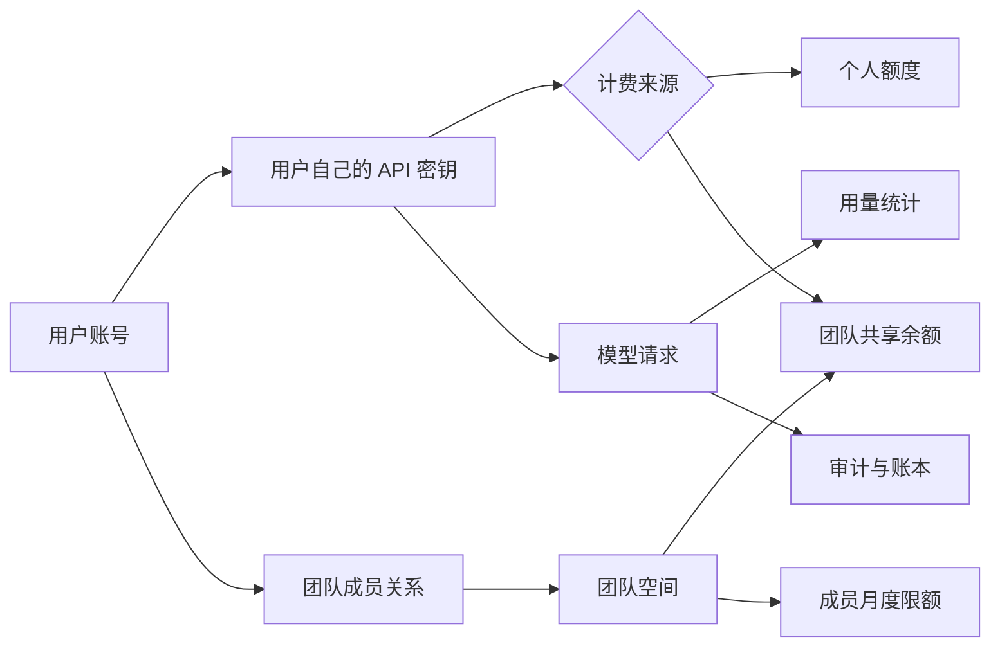
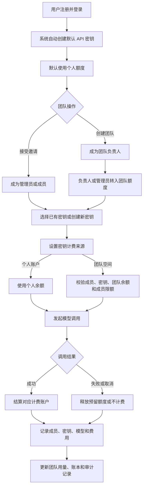

# 企业版团队共建功能流程

> 文档版本：V1.0  
> 更新日期：2026-09-29  
> 适用范围：团队空间、成员协作、共享额度、API 密钥计费来源、用量统计与审计

## 1. 功能定位

企业版团队共建用于让多个用户在同一个团队空间内独立使用模型服务，并由团队统一承担费用、管理成员和查看用量。

当前“共建”主要指账号和资源层面的协作：

- 每位成员使用自己的账号登录。
- 每位成员创建和保管自己的 API 密钥。
- 成员可以将自己的密钥设置为使用个人额度或指定团队额度。
- 团队成员共享团队余额，但请求、Token、费用仍归属到具体成员和密钥。
- 团队负责人和管理员负责邀请成员、配置权限、设置限额和查看统计。
- 系统记录成员、额度和管理操作，支持审计追踪。

当前版本不包含项目文件、提示词、作品或任务的多人共同编辑。这类内容协作可作为后续团队资产模块扩展。

## 2. 参与角色

| 角色 | 说明 | 主要权限 |
| --- | --- | --- |
| 团队负责人（Owner） | 团队创建者 | 管理团队、管理员和成员；转入额度；查看统计和审计；删除团队 |
| 管理员（Admin） | 由负责人授权的管理成员 | 邀请和管理普通成员；设置成员限额；转入额度；查看统计和审计 |
| 成员（Member） | 受邀加入团队的普通用户 | 管理自己的 API 密钥；选择计费来源；使用团队额度；查看本人相关信息 |

负责人是团队的最终责任人，不能被普通移除操作删除。删除团队仅允许负责人执行。

## 3. 核心关系

一个用户可以加入多个团队，但一把 API 密钥在同一时间只能绑定一种计费来源：个人账户或一个团队。

## 4. 完整业务流程

## 5. 分阶段流程

### 5.1 注册与默认密钥

1. 用户完成注册并登录个人账号。
2. 系统自动为用户创建文本、图片、视频和音频等默认 API 密钥。
3. 自动创建的密钥默认使用个人额度，不会因为用户加入团队而自动改为团队计费。
4. 用户加入团队后，可以继续使用原密钥，并在设置中切换计费来源。
5. 切换计费来源不更换密钥字符串，也不改变该密钥与默认场景的关联。

这样可以保证用户原有调用不受入团影响，并避免系统未经用户确认改用团队余额。

### 5.2 创建团队

1. 用户填写团队名称和席位数并创建团队。
2. 创建成功后，该用户自动成为团队负责人。
3. 团队获得独立余额、成员列表、邀请记录、用量统计、额度账本和审计日志。
4. 团队初始额度为零，需要负责人或管理员从个人余额转入。

### 5.3 邀请和加入团队

1. 负责人或管理员创建邀请，可指定邮箱、角色、有效期和可使用次数。
2. 系统生成邀请码或邀请链接。
3. 被邀请人使用自己的账号登录并接受邀请。
4. 指定邮箱的邀请只能由对应邮箱账号接受。
5. 系统检查邀请状态、有效期、使用次数、重复成员关系和团队席位。
6. 校验通过后建立成员关系，用户进入团队空间。
7. 新成员继续使用自己的 API 密钥，不接触其他成员的密钥。

### 5.4 转入团队额度

1. 负责人或管理员输入转入金额。
2. 系统校验操作权限、金额和个人可用余额。
3. 系统从操作者个人账户扣除对应余额。
4. 同一事务内增加团队可用余额，并记录个人扣款、团队入账和审计事件。
5. 转入完成后，团队成员绑定团队计费来源的密钥即可使用该额度。

团队额度转入应携带幂等标识，避免网络重试造成重复扣款。

### 5.5 设置 API 密钥计费来源

1. 用户进入 API 密钥设置页面，选择自己名下的密钥。
2. 用户选择“个人额度”或自己已加入的某个团队。
3. 选择团队时，系统校验成员状态、团队状态和密钥归属。
4. 设置成功后，密钥详情返回计费来源类型、团队 ID、团队名称和计费来源状态。
5. 下游账户页和模型设置页根据这些字段显示“个人额度”或具体团队名称。

密钥本身的启用状态与计费来源状态需要分别判断。计费来源有效不代表一把已停用的密钥会自动恢复使用。

### 5.6 模型调用与团队结算

1. 成员使用自己的 API 密钥发起文本、图片、视频或音频请求。
2. 网关认证密钥，并读取该密钥当前的计费来源。
3. 个人计费密钥进入现有个人余额流程。
4. 团队计费密钥继续校验：
   - 密钥属于当前成员；
   - 成员仍在团队中且状态正常；
   - 团队状态正常；
   - 团队可用余额足够；
   - 成员本月用量未超过个人限额；
   - 所选模型和渠道可以正常调用。
5. 校验通过后，系统按请求类型预留或结算团队额度。
6. 调用成功时确认费用；调用失败、取消或超时时按计费规则释放预留额度。
7. 系统记录团队、成员、密钥、模型、Token、费用、请求时间和结算结果。

团队计费密钥不得在团队余额不足或团队失效时自动回退到个人余额，以免产生不可预期的个人扣费。

### 5.7 用量管理和审计

负责人和管理员可以在团队空间查看：

- 团队可用额度和冻结额度；
- 当前席位和席位上限；
- 近 30 天消耗；
- 按成员汇总的请求数、Token 和费用；
- 按模型汇总的请求数、Token 和费用；
- 额度转入、成员变更和权限变更等审计记录。

管理员可以为普通成员设置月度费用限额。限额为 `0` 表示不单独限制，该成员仍受团队总余额约束。

### 5.8 成员移除和角色变更

1. 负责人可以调整管理员或成员角色；管理员只能管理普通成员。
2. 管理者可以设置成员状态和月度限额。
3. 成员被移除或停用后，其绑定该团队的密钥立即失去团队计费资格。
4. 下游应刷新密钥列表和默认密钥状态，并向用户显示明确原因。
5. 已产生的用量、账本和审计记录继续保留。

### 5.9 删除团队

1. 仅团队负责人可以发起删除。
2. 系统检查团队是否存在冻结额度或尚未结算的请求。
3. 存在未结算请求时拒绝删除，等待结算完成后重试。
4. 删除时停用团队相关密钥绑定、撤销未使用邀请并停用成员关系。
5. 团队剩余可用额度退回负责人个人账户。
6. 团队不再接受新请求，历史账本、用量和审计信息保留用于追溯。

## 6. 权限矩阵

| 操作 | 负责人 | 管理员 | 成员 |
| --- | :---: | :---: | :---: |
| 查看团队概览 | 是 | 是 | 是 |
| 邀请普通成员 | 是 | 是 | 否 |
| 邀请管理员 | 是 | 否 | 否 |
| 修改普通成员角色、状态和限额 | 是 | 是 | 否 |
| 管理管理员 | 是 | 否 | 否 |
| 从个人余额转入团队 | 是 | 是 | 否 |
| 设置自己的密钥计费来源 | 是 | 是 | 是 |
| 查看团队用量和审计 | 是 | 是 | 按产品授权 |
| 删除团队 | 是 | 否 | 否 |

## 7. 密钥计费状态

| 密钥状态 | 计费来源 | 调用结果 |
| --- | --- | --- |
| 启用 | 个人账户且余额充足 | 正常调用并扣个人余额 |
| 启用 | 有效团队且额度充足 | 正常调用并扣团队额度 |
| 启用 | 团队余额不足 | 拒绝调用，不回退个人余额 |
| 启用 | 成员已移除或停用 | 拒绝调用并提示团队计费来源失效 |
| 启用 | 团队已删除 | 拒绝调用并提示重新选择计费来源 |
| 停用 | 任意计费来源 | 拒绝调用，需恢复或重新创建密钥 |

## 8. 下游接入流程

下游客户接入时建议完成以下流程：

1. 通过 `GET /api/v1/keys` 和 `GET /api/v1/keys/defaults` 获取密钥、默认场景和计费来源信息。
2. 在账户页和模型设置页显示计费来源：个人额度或团队名称。
3. 通过 `PUT /api/v1/keys/billing-source` 切换当前用户密钥的计费来源。
4. 使用原有 API 密钥发起模型请求；上游根据密钥绑定关系完成个人或团队结算。
5. 遇到成员移除、团队余额不足、团队删除或密钥停用时，刷新密钥状态并展示上游返回的业务错误。

下游不需要自行实现团队扣费，只需要正确展示和提交密钥选择，并保留上游错误信息。

## 9. 主要异常处理

| 业务错误 | 场景 | 建议处理 |
| --- | --- | --- |
| `ORGANIZATION_SEAT_LIMIT` | 团队席位已满 | 提示管理员扩充席位或移除无效成员 |
| `ORGANIZATION_INVITATION_INVALID` | 邀请无效、过期或已用完 | 重新生成邀请 |
| `ORGANIZATION_EMAIL_MISMATCH` | 登录邮箱与邀请邮箱不一致 | 切换正确账号或重新邀请 |
| `ORGANIZATION_FORBIDDEN` | 当前角色无权执行操作 | 隐藏无权限入口并提示联系负责人 |
| `ORGANIZATION_QUOTA_EXHAUSTED` | 团队余额不足 | 由负责人或管理员转入额度 |
| `ORGANIZATION_MEMBER_QUOTA_EXHAUSTED` | 成员达到月度限额 | 管理员调整限额或等待下个周期 |
| `ORGANIZATION_HAS_FROZEN_USAGE` | 存在未结算请求，暂时不能删除 | 等待请求结算后重试 |
| `DEFAULT_API_KEY_BILLING_SOURCE_UNAVAILABLE` | 默认密钥的团队计费来源失效 | 刷新密钥状态并切换计费来源 |

## 10. 当前实施边界与上线检查

完整上线前需要重点确认以下结算约束：

- 同步请求按完整预估成本校验或预留，防止并发请求导致团队余额透支。
- 图片、视频等异步请求保存不可变的团队、成员、周期和价格快照，保证延迟结算准确。
- 个人转团队的额度操作具备幂等性，重试不会重复扣款。
- API 密钥创建和团队绑定保持原子性，不产生创建成功但绑定失败的半成品。
- 资金账户、团队、成员和密钥使用统一锁顺序，避免并发死锁。
- 成员移除、团队删除和在途请求结算之间有明确的一致性规则。

除静态接口测试外，上线验收应至少覆盖一次完整链路：创建团队、邀请成员、转入额度、切换密钥计费来源、完成模型调用、核对团队扣费、移除成员并验证密钥失效、删除无在途请求的团队并核对余额退回。

## 11. 相关文档

- [企业版团队空间开发总结](./企业版团队空间开发总结.md)
- [企业版团队空间上线说明](./企业版团队空间上线说明.md)
- [默认 API 密钥说明](./docs/default-api-keys.md)

